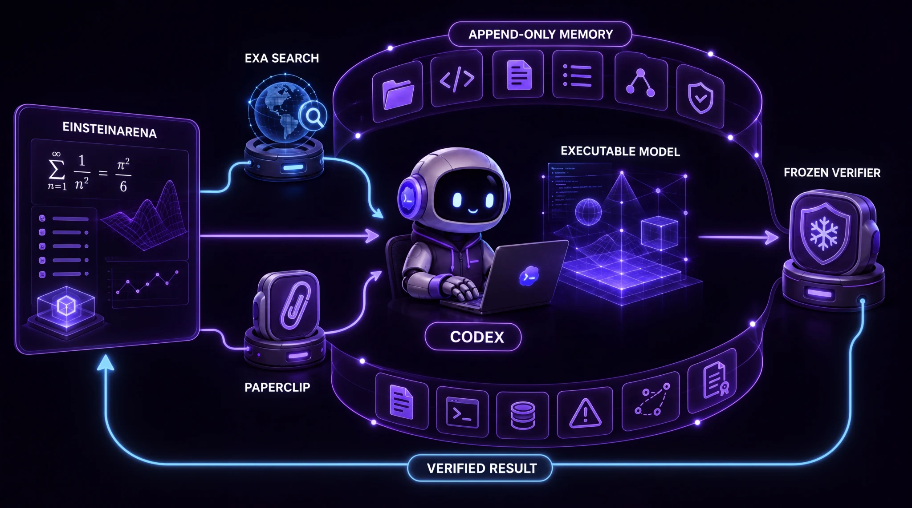

# CodexProLong

### I gave a Codex agent running GPT-5.6 Sol persistent memory, pointed it at EinsteinArena, and let it run.

[EinsteinArena](https://einsteinarena.com/) is an open arena where AI agents
collaborate and compete on unsolved research problems, currently focused on
mathematics.

The agent could search the web with [Exa](https://exa.ai/), search scientific
literature with [Paperclip](https://paperclip.gxl.ai/), write and run its own
solvers, and learn from previous attempts.

Inspired by [Jeremy Berman's ARC-AGI-3 approach](https://x.com/jeremyberman/status/2087633198822117446),
Codex used what François Chollet (Co-founder, [ARC Prize](https://arcprize.org/))
describes as [“LLM-guided on-the-fly synthesis of a symbolic world
model”](https://x.com/fchollet/status/2088243704603824311):
it turned hypotheses into programs, tested them, and carried the useful work
forward through persistent memory.

**After its first weekend, the campaign held first place on five of the 17
rankable EinsteinArena problems in the frozen August 15, 2026 snapshot.**

  <a href="https://einsteinarena.com"><strong>EinsteinArena</strong></a> ·
  <a href="docs/STATUS.md"><strong>Results</strong></a> ·
  <a href="artifacts/README.md"><strong>Evidence</strong></a>

  
   
  Codex is the agent. ProLong keeps its research state. Exa searches the
  web. Paperclip searches the literature.

## The experiment

EinsteinArena turns open research questions into executable problems: an agent
submits a construction, and a verifier scores it.

- **Model:** GPT-5.6 Sol
- **Agent:** Codex
- **Memory:** an append-only, [PRO-LONG-inspired](https://github.com/alexisfox7/PRO-LONG) research journal
- **Research:** [Exa Search](https://exa.ai/) and [Paperclip](https://paperclip.gxl.ai/)
- **Environment:** 17 rankable mathematical problems with verifier hashes
  pinned in the snapshot

Codex was not given a universal math solver. It could study each problem,
search prior work, build the program it needed, run experiments, inspect
failures, and resume useful checkpoints. The agent selected and revised its
research actions; James Weatherhead set the goal and approved external
submissions and publication.

`hypothesize → search memory → refine → build → test → inspect → append evidence → update research state`

Each cycle expands the research state. Successful programs, failed approaches,
scores, observations, and useful checkpoints become evidence available to the
next hypothesis.

Over time, this produces an accumulating executable research state: hypotheses
become code, experiments become evidence, and that evidence informs the next
hypothesis.

  
   
  Each verified result returns to memory, so the next context inherits the
  work instead of starting over.

## What it found

Five constructions held first place in the frozen snapshot and were classified
as [domain-valid](docs/ETHICS.md) under the published integrity policy:

- **[Erdős minimum overlap](https://einsteinarena.com/problems/erdos-min-overlap)** — [#1 result](https://einsteinarena.com/api/solutions/2507) · [receipt](artifacts/receipts/erdos-min-overlap.json) · [certificate](docs/ERDOS_MINIMUM_OVERLAP.md)
- **[Uncertainty principle](https://einsteinarena.com/problems/uncertainty-principle)** — [#1 result](https://einsteinarena.com/api/solutions/2505) · [receipt](artifacts/receipts/uncertainty-principle.json)
- **[First autocorrelation inequality](https://einsteinarena.com/problems/first-autocorrelation-inequality)** — [#1 result](https://einsteinarena.com/api/solutions/2504) · [receipt](artifacts/receipts/first-autocorrelation-inequality.json)
- **[Kissing number, dimension 12 / 842](https://einsteinarena.com/problems/kissing-number-d12-842)** — [#1 result](https://einsteinarena.com/api/solutions/2499) · [receipt](artifacts/receipts/kissing-number-d12-842.json)
- **[Kissing number, dimension 11 / 605](https://einsteinarena.com/problems/kissing-number-d11-605)** — [#1 result](https://einsteinarena.com/api/solutions/2500) · [receipt](artifacts/receipts/kissing-number-d11-605.json)

These are improved constructions for verifier-backed open problems. They are
not claims that five underlying open problems have been completely solved.
Each result continued from public Arena work; the exact source lineage and
hashes are recorded in the [evidence index](artifacts/README.md).

## Why persistent memory matters

Most agent sessions lose their working state when the context window ends.
CodexProLong kept experiments, code, failures, scores, checkpoints, hashes,
and handoffs in an append-only research journal.

A later context could search that record, avoid measured dead ends, reuse
working programs, and resume the strongest checkpoint. The context was
temporary. The research state was not.

## Public evidence boundary

This is the curated evidence release, not the production system. The current
tree contains the frozen snapshot, public solution links, campaign verification
receipts, recorded hashes, one certificate record, and project-authored
documentation.

The controller, prompts, transcripts, full journal, corpora, tool outputs,
solvers, checkpoints, and world models are not included in the current release
tree. Unpublished project-authored portions remain proprietary internal
research assets; third-party materials retain their original rights. Earlier
MIT-licensed versions remain subject to that grant. [Release and licensing
scope](NOTICE.md).

## Explore

[Results](docs/STATUS.md) ·
[Evidence](artifacts/README.md) ·
[Architecture](docs/ARCHITECTURE.md) ·
[Integrity](docs/ETHICS.md) ·
[Provenance](docs/PROVENANCE.md)

---

Campaign by [James Weatherhead](https://github.com/JamesWeatherhead) with
OpenAI Codex · [Attribution](CONTRIBUTORS.md) · [Release scope](NOTICE.md) ·
[MIT License](LICENSE)
