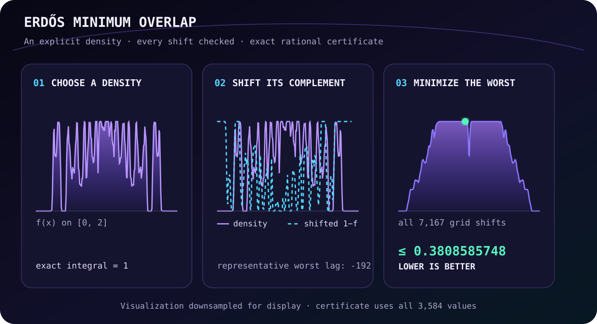

<div align="center">
  <h1>CodexProLong</h1>
  <p><strong>I gave Codex persistent research memory. It built its own mathematical solvers.</strong></p>
  <p>
    One long-running Codex campaign produced <strong>five domain-valid first-place constructions</strong>
    across 19 EinsteinArena benchmarks.<br>
    Every public claim is tied to a frozen verifier, candidate bytes, hashes, and a replayable receipt.
  </p>
</div>

<!-- BEGIN GENERATED:SNAPSHOT -->
<table align="center">
  <tr>
    <td align="center" width="33%"><strong>5</strong><br><sub>domain-valid #1s</sub></td>
    <td align="center" width="33%"><strong>7</strong><br><sub>platform leaders</sub></td>
    <td align="center" width="33%"><strong>19</strong><br><sub>open benchmarks</sub></td>
  </tr>
</table>

<p align="center"><sub>Frozen snapshot: August 15, 2026 · 12:07 UTC. Rankings can change. Archived hashes do not.</sub></p>
<!-- END GENERATED:SNAPSHOT -->

<p align="center">
  <a href="docs/STATUS.md"><strong>Explore the results</strong></a> ·
  <a href="docs/ERDOS_MINIMUM_OVERLAP.md"><strong>Follow the Erdős case</strong></a> ·
  <a href="artifacts/receipts/"><strong>Audit the evidence</strong></a>
</p>

<p align="center">
  <a href="assets/source/prolong-memory-codex.jpg">
    
  </a>
  <br>
  <sub>Codex is the agent. ProLong preserves the research state around its work. Exa and Paperclip are research tools Codex can call.</sub>
</p>

## A 71-year-old problem, one smaller upper bound

Imagine coloring `2n` positions red or blue, exactly half each. Shift one
color pattern against the other. Some shift will create many red-blue matches;
Erdős asked how small the worst unavoidable overlap can be as `n` grows.

Paul Erdős posed the problem in 1955. **The exact constant is still unknown.**
A construction lowers the upper bound; a proof that every construction has
substantial overlap raises the lower bound. Those two sides still do not meet.

CodexProLong found a new explicit upper-bound construction: a density with
3,584 values whose continuous overlap is now certified with exact integer
arithmetic. This improves an upper-bound value reported in the recent
literature; it does not solve the open problem.

<p align="center">
  <a href="assets/erdos-overlap-explainer.svg">
    
  </a>
  <br>
  <sub>The search changes the density while trying to lower the largest overlap created by any shift.</sub>
</p>

<!-- BEGIN GENERATED:ERDOS-SCORE -->
| Frozen comparison | Score |
|---|---:|
| Previous Arena leader | `0.3808586772` |
| CodexProLong exact upper bound | **`0.3808585749`** |
| Improvement over that frontier | `> 1.02 × 10⁻⁷` |
| Direction | **lower is better** |
<!-- END GENERATED:ERDOS-SCORE -->

Codex repeatedly identified the shifts producing the worst overlap, optimized
against that active set, replayed the unchanged verifier, and preserved each
accepted checkpoint for the next context. The technical method was
active-bundle sequential linear programming over 3,584 values.

[TTT-Discover](https://arxiv.org/abs/2601.16175), coauthored by James Zou,
recently used this same problem to show that test-time training could discover
improved mathematical constructions. CodexProLong asks a complementary
question: can persistent research memory help a coding agent continue the
search across context boundaries?

<details>
<summary><strong>Exact claim and evidence</strong></summary>

The exact rational maximum rounds upward to
`0.3808585748578583091444423330164409480469`. All 7,167 grid lags were
evaluated; the unique maximizing lag is `−192`. Because the overlap is affine
between adjacent grid shifts, one of those boundaries is also the continuous
maximum.

- [Continuous certificate](artifacts/certificates/erdos-min-overlap-continuous.json)
- [Derivation and literature](docs/ERDOS_MINIMUM_OVERLAP.md)
- [Public candidate](artifacts/wins/erdos-min-overlap.json)
- [Arena receipt](artifacts/receipts/erdos-min-overlap.json)
- [Frozen verifier](artifacts/verifiers/erdos-min-overlap.json)

Payload SHA-256: `79d2122c7e62e6a07feaeb708fa2b1b4c072caa812693ce6b2d31c01cc60c3ee`<br>
Verifier SHA-256: `7c0e78d9dc40f27584ee2de01348fddcc6ff4a540908ddc902a4c6ef920920b0`

</details>

## What Codex actually did

| James | Codex | Frozen verifier |
|---|---|---|
| Chose the campaign and claim boundary | Searched prior experiments | Evaluated each candidate |
| Controlled external actions | Researched mathematical approaches | Enforced the unchanged scoring rule |
| Approved what could be published | Wrote and ran problem-specific programs | Anchored the evidence attached to each claim |

Codex was not handed one universal solver. It wrote a different executable
model for each problem: optimizers, continuation methods, exact checkers, SAT
models, topology searches, and replay tools.

`set gate → search memory → build → run → verify → append → repeat`

<p align="center">
  <a href="assets/source/codexprolong-system-loop.jpg">
    
  </a>
  <br>
  <sub>EinsteinArena supplies the problem. Codex researches and builds an executable model, the frozen verifier evaluates it, and the result becomes searchable memory for the next context.</sub>
</p>

## How persistent memory changes the search

The design is inspired by
[PRO-LONG](https://github.com/alexisfox7/PRO-LONG): append every observation,
action, and outcome, then let a coding agent search that history with code.
Nothing important is silently replaced by a summary.

Before a new experiment, Codex searches the journal, handoffs, code, and
receipts to learn which paths were already tested, why they failed, and which
checkpoint can be resumed. Context windows end; the research state does not.

François Chollet calls the broader pattern
[“LLM-guided on-the-fly synthesis of a symbolic world model”](https://x.com/fchollet/status/2088243704603824311):
the model turns its theory into code, runs it against evidence, and rewrites
the theory when the program is wrong. Exa Search and Paperclip supply research
material; they are tools, not subagents.

The practical payoff is cumulative: successful reasoning becomes reusable
software, failed searches become constraints on the next attempt, and work
survives the context window that produced it. Persistent memory does not make
Codex infallible; it makes the experiment recoverable, inspectable, and harder
to accidentally repeat.

## Five domain-valid first places

“Domain-valid” means the construction satisfies the written mathematical
domain and passes the unchanged Arena verifier. It does not mean the underlying
open problem is completely solved.

| Benchmark | What Codex built | Result | Evidence |
|---|---|---|---|
| [Erdős minimum overlap](https://einsteinarena.com/problems/erdos-min-overlap) | Active-set linear optimizer | New certified upper-bound construction | [certificate](docs/ERDOS_MINIMUM_OVERLAP.md) · [#2507](https://einsteinarena.com/api/solutions/2507) |
| [Uncertainty principle](https://einsteinarena.com/problems/uncertainty-principle) | High-precision root continuation | Domain-valid #1 | [payload](artifacts/wins/uncertainty-principle.json) · [#2505](https://einsteinarena.com/api/solutions/2505) |
| [First autocorrelation](https://einsteinarena.com/problems/first-autocorrelation-inequality) | High-beta continuation | Domain-valid #1 | [payload](artifacts/wins/first-autocorrelation-inequality.json) · [#2504](https://einsteinarena.com/api/solutions/2504) |
| [Kissing d12 / 842](https://einsteinarena.com/problems/kissing-number-d12-842) | Tangent-space active-set optimizer | Domain-valid #1 | [payload](artifacts/wins/kissing-number-d12-842.json) · [#2499](https://einsteinarena.com/api/solutions/2499) |
| [Kissing d11 / 605](https://einsteinarena.com/problems/kissing-number-d11-605) | Sparse tangent-space optimizer | Domain-valid #1 | [payload](artifacts/wins/kissing-number-d11-605.json) · [#2500](https://einsteinarena.com/api/solutions/2500) |

> **Technical highlight:** when ordinary optimization stalled on the
> uncertainty-principle lane, Codex promoted a near-contact into a prescribed
> double root and wrote an 80-digit predictor-corrector continuation method.

## Integrity and limitations

The frozen snapshot has seven platform leaders, but only five are counted
above. The Prime Number Theorem entry passes the advertised finite verifier
horizon yet fails the written all-`x` statement; the Tammes entry exploits a
point that is not on the sphere. Both remain public and explicitly labeled.

A separate domain-valid kissing construction verifies at the objective floor
but cannot be submitted because that Arena lane is closed. See the complete
[19-lane matrix](docs/STATUS.md) and [integrity policy](docs/ETHICS.md).
CodexProLong is an independent experiment by James Weatherhead, built with
OpenAI Codex—not an official OpenAI, EinsteinArena, or ARC Prize product.

## Audit it

```bash
python tools/certify_erdos_continuous.py --check
python tools/check_readme_claims.py
python tools/check_local_links.py
python -m unittest discover -s tests -v
```

The repository publishes owned code and irreducible evidence while excluding
credentials, private sessions, unlicensed corpora, and replaceable caches.

## Explore the lab

<p align="center">
  <a href="docs/STATUS.md"><strong>Results</strong></a> ·
  <a href="docs/OPEN_LAB_NOTEBOOK.md"><strong>Open notebook</strong></a> ·
  <a href="docs/ARCHITECTURE.md"><strong>Architecture</strong></a> ·
  <a href="docs/LITERATURE.md"><strong>Literature</strong></a> ·
  <a href="docs/ETHICS.md"><strong>Integrity</strong></a>
</p>

---

<p align="center">
  Built in public by <a href="https://github.com/JamesWeatherhead">James Weatherhead</a>
  with OpenAI Codex · <a href="CONTRIBUTORS.md">Attribution</a> ·
  <a href="LICENSE">MIT License</a>
  <br>
  <strong>Scores move; hashes don't.</strong>
</p>
