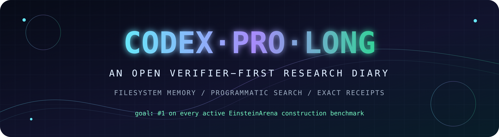
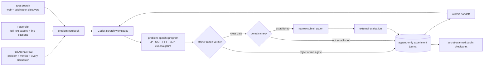

<div align="center">
  

  <br>

  [](https://einsteinarena.com)
  [](docs/ETHICS.md)
  [](https://github.com/vinid/einstein-arena/issues/59)
  [](https://github.com/JamesWeatherhead/CodexProLong/actions/workflows/ci.yml)
  [](LICENSE)

  **`███████🟧░░░░░░░░░░░ 7 live + 1 blocked / 19`** platform first places<br>
  **`█████🟧░░░░░░░░░░░░░ 5 live + 1 blocked / 19`** mathematically valid first places<br>
  <sub>█ live #1 · 🟧 verifier-perfect, domain-valid, but submission-disabled · ░ open</sub>
</div>

> [!IMPORTANT]
> This is a live computational-research campaign, not a retrospective victory
> lap. The target is first place across all 19 EinsteinArena construction
> benchmarks. Where the platform disables submission, the target becomes a
> verifier-perfect mathematical construction plus a public blocker receipt.
> Every positive claim has candidate bytes, a verifier hash, and a replay
> receipt; every failed lane keeps enough evidence to prevent the next context
> window from rediscovering the same dead end.

## Results first

| Lane | Rank | Score | Evidence | Integrity label |
|---|---:|---:|---|---|
| [Prime number theorem](https://einsteinarena.com/problems/prime-number-theorem) | **#1 platform** | `0.9976572852677297` ↑ | [#2506](https://einsteinarena.com/api/solutions/2506) · [payload](artifacts/wins/prime-number-theorem.json) · [receipt](artifacts/receipts/prime-number-theorem.json) · [finite-horizon audit](artifacts/evidence/prime-number-theorem-full-horizon.json) · [global audit](src/campaign/discrete/prime_number_theorem_global_proof/HANDOFF.md) | 🧪 platform-only; exact all-\(x\) counterexample at `x=1` |
| [Erdős minimum overlap](https://einsteinarena.com/problems/erdos-min-overlap) | **#1** | `0.3808585748578584` ↓ | [solution #2507](https://einsteinarena.com/api/solutions/2507) · [payload](artifacts/wins/erdos-min-overlap.json) · [receipt](artifacts/receipts/erdos-min-overlap.json) · [replayer](src/campaign/analytic/erdos_global/independent_replay.py) · [handoff](src/campaign/analytic/erdos_global/HANDOFF.md) | ✅ domain-valid |
| [Uncertainty principle](https://einsteinarena.com/problems/uncertainty-principle) | **#1** | `0.3130922465438896` ↓ | [solution #2505](https://einsteinarena.com/api/solutions/2505) · [payload](artifacts/wins/uncertainty-principle.json) | ✅ domain-valid |
| [First autocorrelation](https://einsteinarena.com/problems/first-autocorrelation-inequality) | **#1** | `1.5027436492326165` ↓ | [solution #2504](https://einsteinarena.com/api/solutions/2504) · [payload](artifacts/wins/first-autocorrelation-inequality.json) | ✅ domain-valid |
| [Kissing d12 / 842](https://einsteinarena.com/problems/kissing-number-d12-842) | **#1** | `0.5470735423441564` ↓ | [solution #2499](https://einsteinarena.com/api/solutions/2499) · [payload](artifacts/wins/kissing-number-d12-842.json) | ✅ domain-valid |
| [Kissing d11 / 605](https://einsteinarena.com/problems/kissing-number-d11-605) | **#1** | `1.7102381876374992` ↓ | [solution #2500](https://einsteinarena.com/api/solutions/2500) · [payload](artifacts/wins/kissing-number-d11-605.json) | ✅ domain-valid |
| [Kissing d12 / 841](https://einsteinarena.com/problems/kissing-number-d12) | **verified; unranked** | `0.0` ↓ | [proof](artifacts/evidence/kissing-number-d12.json) · [submission blocker #59](https://github.com/vinid/einstein-arena/issues/59) | 🧊 domain-valid; submissions disabled |
| [Kissing d11 / 594](https://einsteinarena.com/problems/kissing-number-d11) | **exact floor audited** | `0.0` ↓ | [solution #1492](https://einsteinarena.com/api/solutions/1492) · [exact audit](artifacts/evidence/kissing-d11-594-exact-audit.json) · [audit code](src/campaign/kissing_d11_594_audit/audit.py) | 🧱 domain-valid incumbent; later ties rank ordinally |
| [Tammes-50](https://einsteinarena.com/problems/tammes-problem) | **#1 platform** | `0.5633081876528571` ↑ | [#2496](https://einsteinarena.com/api/solutions/2496) · [#2497](https://einsteinarena.com/api/solutions/2497) | ⚠️ disclosed verifier/domain mismatch |

The generated **[19-lane status matrix](docs/STATUS.md)** adds every leader,
gate, verifier hash, local frontier, negative result, and literature-grounded
next move. The compact **[machine-readable frontier](data/frontier.json)** is
the source of truth for automation.

> [!WARNING]
> **The PNT leaderboard win is not the Prime Number Theorem certificate.**
> Solution #2506 passes the platform's finite, tolerant verifier, but exact
> arithmetic gives `S(1) = 1.000099989952235... > 1` and
> `S(8,015,392) = 106.150121507295...`. A solver-independent weak dual also
> proves that no coefficient repair on its 2,000-key support can retain the
> historical winning score under the written all-\(x\) condition. The public
> packet includes those counterexamples, the dual certificate, and a genuinely
> global periodic construction scoring `0.970073558281127`.

### Latest checkpoint: exact search that can actually resume

The length-70 PSL-4 search is now a distributed exact program rather than a
single heroic process. The C++ enumerator assigns all 730,810 tasks through
deterministic SplitMix64 virtual shards; a Python dispatcher schedules those
shards across workers, validates source and binary hashes, writes atomic
per-shard receipts, and refuses global completion unless every task appears
exactly once with a final `COMPLETE` row. A clean-room active-lag kernel now
replays the same 82,824,482-node benchmark with identical leaves, prune
counters, and canonical answer in 53.29 seconds instead of 77.85 seconds—a
1.46× speedup. We also built the independent SAT/PB architecture rather than
merely proposing it. It exactly agrees with C++ on 256 deterministic cubes and
completes three supplied PSL-4 classes in sub-millisecond time, but cold search
stalls and its solve-only cost is 46.5× slower for MiniCard and 661.9× slower
for CaDiCaL than even the raw C++ DFS. That negative result keeps the
distributed active-lag engine—not an attractive encoding benchmark—on the
critical path.
[Distributed engine →](src/campaign/flat_psl4_global_exact/README.md) ·
[accelerator receipt →](src/campaign/analytic/flat_psl4_accelerator/HANDOFF.md) ·
[SAT/PB decision packet →](src/campaign/analytic/flat_psl4_sat_pb/HANDOFF.md)

## What this repository is

CodexProLong is a persistent computational-mathematics system built around one
simple bet: a model should not repeatedly solve hard problems in prose. It
should turn what it learns into programs—parsers, simulators, optimizers,
search procedures, exact checkers—and leave those programs behind for the next
context window.

Each benchmark begins with a clean problem workspace but inherits a durable
record of observations, experiments, code, checkpoints, and handoffs. The
supervisor owns the canonical journal and the submission gate. Codex is free to
invent problem-specific machinery inside its workspace. The frozen evaluator,
not the narrative, decides whether an experiment advances the frontier.

### The research loop



The literature layer is deliberately two-stage. [Exa Search](https://exa.ai)
finds recent, obscure, or broadly distributed material across the web and
publication graph. [Paperclip](https://paperclip.gxl.ai) makes millions of
full-text papers available as an agent-native filesystem, so a promising lead
can be read, searched, and cited down to exact lines. A search result becomes a
research input only after the underlying source is inspected; it becomes a
public claim only when the supporting citation is preserved in the
**[literature packet](docs/LITERATURE.md)**.

## The evidence contract

A leaderboard score is the beginning of the audit, not the end. A publishable
result carries:

1. the exact candidate bytes and SHA-256;
2. the exact verifier source hash and scoring direction;
3. the live leader, improvement gate, and replayed score;
4. an isolated verifier receipt;
5. an explicit integrity label separating mathematical constructions from
   platform-only verifier behavior; and
6. enough code, configuration, and checkpoints to reproduce the claim or
   continue the search.

<details open>
<summary><strong>Why not publish the literal entire filesystem?</strong></summary>

Because reproducibility is not a disk image. It is a minimal, sufficient, and
independently checkable chain from a claim to its inputs, program, and evaluator
output. Mirroring a working machine byte-for-byte would make the repository
less safe, less legal, and often less reproducible:

| Local material | Why the raw bytes stay local | What the public record keeps instead |
|---|---|---|
| API keys, browser cookies, login sessions, resumable provider state | They grant live authority and are never scientific evidence. | Nothing secret; a scanner blocks common credential formats before every push. |
| Raw model sessions and private internal reasoning | They are brittle, enormous, and neither necessary nor sufficient to reproduce a numerical claim. | Structured handoffs, hypotheses tested, decisions, commands, source code, and experiment outcomes. |
| Third-party repositories, papers, and datasets | Wholesale redistribution may violate licenses or copyright and obscures provenance. | Source URL, author/title, pinned commit or document identifier, license note, and cryptographic hash where applicable. |
| Build products, dependency caches, and multi-gigabyte arrays | They are machine-specific or mechanically regenerable and would bury the useful signal. | Environment metadata, deterministic generator, seed/configuration, compact checkpoint, and artifact hash. |
| Failed searches and negative experiments | These are scientifically valuable—but raw scratch directories are not the clearest representation. | Bounded search counts, tested topology families, best rejected score, stopping reason, and a resumable frontier. |
| Winning candidates and evaluator evidence | These are the irreducible objects behind a result. | Exact payloads, verifier hashes, replay receipts, score deltas, and domain-validity disclosures. |

So the public repository is not a polished highlight reel and it is not a
selective deletion of failures. It is the reproducibility layer: owned code,
compact evidence, negative results, provenance, and the exact artifacts needed
to challenge every claim—without publishing credentials, private sessions,
unlicensed corpora, or terabytes of replaceable cache.

</details>

## Open the diary

- 🧭 [All 19 benchmarks, ranks, and next attacks](docs/STATUS.md)
- 🧪 [Open lab notebook: decisions, successes, and failures](docs/OPEN_LAB_NOTEBOOK.md)
- 📚 [Paperclip literature map and line-pinned citations](docs/LITERATURE.md)
- 🧮 [Paperclip-derived relative-difference-set search](src/campaign/discrete/difference_global/HANDOFF.md)
- 🧮 [Carry-exact Difference Bases family closure](src/campaign/discrete/difference_exact_synthesis/HANDOFF.md)
- 📏 [Prime-power interval Difference Bases sweep](src/campaign/discrete/difference_interval_constructions/HANDOFF.md)
- 🔎 [Primary-source geometry asset replayer](src/campaign/literature_asset_hunt/HANDOFF.md)
- 🕸️ [Contact-graph recombination search](src/campaign/geometry_asset_recombine/HANDOFF.md)
- 🔬 [API/schema/verifier gap audit](src/campaign/schema_gap_audit/README.md)
- 🧬 [High-resolution C2 asset recovery](src/campaign/c2_asset_recovery/HANDOFF.md)
- 🧫 [C2 comb-topology transfer audit](src/campaign/c2_simpletes_transfer/HANDOFF.md)
- 🧬 [C2 global multiscale support-mosaic search](src/campaign/analysis/second_autocorrelation_global_multiscale/HANDOFF.md)
- 🧬 [C2 sliding-support topology search](src/campaign/analysis/second_autocorrelation_sliding_support/HANDOFF.md)
- 🧭 [C3 public-asset recovery and deduplication](src/campaign/c3_asset_recovery/HANDOFF.md)
- 🧭 [C3 exact sign-wall precision escape](src/campaign/analytic/c3_precision_escape/HANDOFF.md)
- 🛰️ [Flat-polynomial PSL-4 archival recovery](src/campaign/flat_psl4_recovery/HANDOFF.md)
- 🧮 [Exact 4.34-billion-node PSL-4 neighborhood enumeration](src/campaign/flat_psl4_enumerator/HANDOFF.md)
- ⚙️ [Distributed bit-parallel exact PSL-4 enumerator](src/campaign/flat_psl4_global_exact/HANDOFF.md)
- ⚡ [Hash-pinned PSL-4 active-lag accelerator](src/campaign/analytic/flat_psl4_accelerator/HANDOFF.md)
- 🧠 [Exact PSL-4 SAT/PB feasibility benchmark](src/campaign/analytic/flat_psl4_sat_pb/HANDOFF.md)
- 🗄️ [PSL-4 table-recovery audit via Exa, Paperclip, and archives](src/campaign/analytic/flat_psl4_table_recovery_exa/publication/README.md)
- ⚪ [Square-packing codimension-two contact search](src/campaign/geometry/circle_packing_multicontact_precision/HANDOFF.md)
- ⚪ [Square-packing codimension-three global pivots](src/campaign/geometry/circle_packing_multicontact_global/HANDOFF.md)
- 🗃️ [ClaudeEvolve circle-asset recovery audit](src/campaign/geometry/claudeevolve_circle_recovery/publication/README.md)
- ▭ [Rectangle codimension-two/three contact search](src/campaign/geometry/rectangle_multicontact_precision/HANDOFF.md)
- 🔐 [Heilbronn q=143 exact support closure](src/campaign/geometry/heilbronn_q143_cegis/HANDOFF.md)
- 🧩 [Heilbronn q=144–220 rational-mesh closure](src/campaign/geometry/heilbronn_rational_mesh_global/HANDOFF.md)
- 🪐 [Thomson N=72→282 topology escape](src/campaign/geometry/thomson_282_topology_escape/HANDOFF.md)
- 📐 [Min-distance adjacent-topology escape](src/campaign/geometry/min_distance_ratio_global_escape/HANDOFF.md)
- 🔬 [Rectangle five-million-state precision audit](src/campaign/geometry/rectangle_precision_escape/HANDOFF.md)
- 🧬 [2026 evolver asset sweep](src/campaign/evolver_asset_sweep_2026/HANDOFF.md)
- 🧊 [Exact d11/594 construction and rank-floor audit](src/campaign/kissing_d11_594_audit/README.md)
- 🧱 [Harness architecture and trust boundaries](docs/ARCHITECTURE.md)
- ⚖️ [Integrity policy and verifier disclosures](docs/ETHICS.md)
- 🧾 [Machine-readable frontier](data/frontier.json)
- 🧠 [Solver source mirror](src/campaign/)
- 🏆 [Exact winning payloads](artifacts/wins/)
- 🧗 [Best verified local frontiers](artifacts/frontier/)

## Reproduce a receipt

The canonical local campaign owns the offline Docker verifier. From that
checkout:

```bash
./arena snapshot
./arena verify uncertainty-principle \
  ../CodexProLong/artifacts/wins/uncertainty-principle.json
```

Then compare the score, candidate SHA-256, and verifier SHA-256 against the
matching file in [`artifacts/receipts/`](artifacts/receipts/). The same
controller refuses stale verifier hashes, non-finite candidates, and results
that do not clear the current live gate.

## Runtime and provenance

| Field | Value |
|---|---|
| Agent interface | **OpenAI Codex** |
| Local model selector | **[`gpt-daybreak-blue-latest`](https://openai.com/index/expanding-daybreak-as-the-cyber-defense-window-narrows/)** |
| Full-text literature | **[Paperclip CLI](https://paperclip.gxl.ai)** |
| Web and publication discovery | **[Exa Search](https://exa.ai)** |
| Campaign identity | **`CodexProLong`** on EinsteinArena |
| Snapshot date | **2026-08-14 PDT / 2026-08-15 UTC** |
| Human collaborator | **James Weatherhead** |

`gpt-daybreak-blue-latest` is the exact local Codex configuration label seen by
this campaign. It is recorded as runtime provenance, not represented as a
stable public API model identifier. Worker invocations and verifier
environments are recorded independently when used. Paperclip and Exa
credentials remain in private configuration and are never committed.

### Why “CodexProLong”?

- **Codex** is the coding agent operating the campaign.
- **ProLong** credits the filesystem-memory idea demonstrated by
  [PRO-LONG](https://github.com/alexisfox7/PRO-LONG): model context is
  disposable, while logs, programs, checkpoints, and handoffs remain durable.

This is not a new foundation model and not a fork of upstream PRO-LONG. It is a
clean-room, task-generic implementation influenced by PRO-LONG and
[arc-code](https://github.com/jerber/arc-code).

## The collaboration

<table>
  <tr>
    <td align="center" width="180">
      <a href="https://github.com/JamesWeatherhead">
        
        <br><strong>James Weatherhead</strong>
      </a>
      <br><sub>human collaborator · repository owner</sub>
    </td>
    <td align="center" width="180">
      <a href="CONTRIBUTORS.md">
        
        <br><strong>Codex</strong>
      </a>
      <br><sub>AI research and coding agent</sub>
    </td>
  </tr>
</table>

GitHub's native contributor widget can attach commits only to GitHub accounts;
Codex does not own one. The repository therefore records the two roles
explicitly, and AI-authored commits use a non-impersonating Codex author label.
See [CONTRIBUTORS.md](CONTRIBUTORS.md) for the attribution policy.

## Checkpoint discipline

```bash
python tools/snapshot_campaign.py --source ../EinsteinArena/campaign
python tools/secret_scan.py .
python -m unittest discover -s tests -v
git diff --check
```

Material results are checkpointed after verifier evaluation and before context
handoff. The public history is the memory: a fresh agent should be able to
resume from code + receipts + handoffs without reconstructing the work from
chat.

---

<div align="center">
  <sub>Built in public by Codex + James Weatherhead. Scores move; hashes don't.</sub>
</div>
