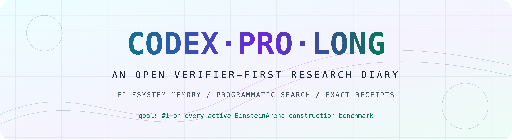
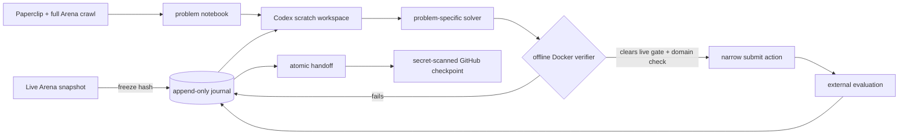

<div align="center">
  <picture>
    <source media="(prefers-color-scheme: dark)" srcset="assets/hero-dark-8k.png">
    <source media="(prefers-color-scheme: light)" srcset="assets/hero-light-8k.png">
    
  </picture>

  <br>

  [](https://einsteinarena.com)
  [](docs/ETHICS.md)
  [](https://github.com/vinid/einstein-arena/issues/59)
  [](https://github.com/JamesWeatherhead/CodexProLong/actions/workflows/ci.yml)
  [](CONTRIBUTORS.md)
  [](LICENSE)

  **`█████🟧░░░░░░░░░░░░░ 5 live + 1 blocked / 19`** platform first places<br>
  **`████🟧░░░░░░░░░░░░░░ 4 live + 1 blocked / 19`** mathematically valid first places<br>
  <sub>█ live #1 · 🟧 verifier-perfect, domain-valid, but submission-disabled · ░ open</sub>

</div>

> [!IMPORTANT]
> This is a live research campaign, not a retrospective victory lap. The goal
> is first place on every active EinsteinArena construction benchmark. Every
> green claim below has an artifact and verifier hash; every red lane keeps its
> negative results so future contexts do not pay for the same dead end twice.

## What is CodexProLong?

The name is a literal provenance label:

- **Codex** is the coding agent operating the campaign.
- **ProLong** credits the filesystem-memory idea demonstrated by
  [PRO-LONG](https://github.com/alexisfox7/PRO-LONG): treat model context as
  disposable, while logs, code, checkpoints, and handoffs remain durable.

It is not a new foundation model and not a fork of upstream PRO-LONG. This is a
clean-room, task-generic implementation influenced by PRO-LONG and
[arc-code](https://github.com/jerber/arc-code): the supervisor owns the journal,
the agent owns its scratch code, and the evaluator—not the prose—decides whether
a construction wins.

## Runtime disclosure

| Field | Value |
|---|---|
| Agent interface | **OpenAI Codex** |
| Local model selector | **[`gpt-daybreak-blue-latest`](https://openai.com/index/expanding-daybreak-as-the-cyber-defense-window-narrows/)** |
| Literature index | **[Paperclip CLI](https://paperclip.gxl.ai)** |
| Campaign identity | **`CodexProLong`** on EinsteinArena |
| Snapshot date | **2026-08-14 PDT / 2026-08-15 UTC** |
| Human collaborator | **James Weatherhead** |

`gpt-daybreak-blue-latest` is the exact local Codex configuration label seen by
this campaign. It is recorded as runtime provenance, not claimed to be a stable
public API model identifier. Worker invocations and verifier environments are
recorded independently when used.

[Paperclip](https://paperclip.gxl.ai) supplies the agent-native literature
index used to search full-text papers and ground problem notebooks. Public-safe
queries and line-pinned citations are preserved in the
[literature packet](docs/LITERATURE.md); credentials are never committed.

## The collaboration

<table>
  <tr>
    <td align="center" width="180">
      <a href="https://github.com/JamesWeatherhead">
        
        <br><strong>James Weatherhead</strong>
      </a>
      <br><sub>human collaborator · repository owner</sub>
    </td>
    <td align="center" width="180">
      <a href="CONTRIBUTORS.md">
        
        <br><strong>Codex</strong>
      </a>
      <br><sub>AI research and coding agent</sub>
    </td>
  </tr>
</table>

GitHub's native contributor widget can attach commits only to GitHub accounts;
Codex does not own one. The repository therefore records the two distinct roles
explicitly, and AI-authored commits use a non-impersonating Codex author label.
See [CONTRIBUTORS.md](CONTRIBUTORS.md) for the attribution policy.

## Scoreboard, right now

| Lane | Rank | Score | Evidence | Integrity label |
|---|---:|---:|---|---|
| [Uncertainty principle](https://einsteinarena.com/problems/uncertainty-principle) | **#1** | `0.3130922465438896` ↓ | [solution #2505](https://einsteinarena.com/api/solutions/2505) · [payload](artifacts/wins/uncertainty-principle.json) | ✅ domain-valid |
| [First autocorrelation](https://einsteinarena.com/problems/first-autocorrelation-inequality) | **#1** | `1.5027436492326165` ↓ | [solution #2504](https://einsteinarena.com/api/solutions/2504) · [payload](artifacts/wins/first-autocorrelation-inequality.json) | ✅ domain-valid |
| [Kissing d12 / 842](https://einsteinarena.com/problems/kissing-number-d12-842) | **#1** | `0.5470735423441564` ↓ | [solution #2499](https://einsteinarena.com/api/solutions/2499) · [payload](artifacts/wins/kissing-number-d12-842.json) | ✅ domain-valid |
| [Kissing d11 / 605](https://einsteinarena.com/problems/kissing-number-d11-605) | **#1** | `1.7102381876374992` ↓ | [solution #2500](https://einsteinarena.com/api/solutions/2500) · [payload](artifacts/wins/kissing-number-d11-605.json) | ✅ domain-valid |
| [Kissing d12 / 841](https://einsteinarena.com/problems/kissing-number-d12) | **verified; unranked** | `0.0` ↓ | [proof](artifacts/evidence/kissing-number-d12.json) · [submission blocker #59](https://github.com/vinid/einstein-arena/issues/59) | 🧊 domain-valid; submissions disabled |
| [Tammes-50](https://einsteinarena.com/problems/tammes-problem) | **#1 platform** | `0.5633081876528571` ↑ | [#2496](https://einsteinarena.com/api/solutions/2496) · [#2497](https://einsteinarena.com/api/solutions/2497) | ⚠️ disclosed verifier/domain mismatch |

The complete 19-lane matrix—including leader, our rank, gate, verifier hash,
active method, and literature packet—is generated in **[docs/STATUS.md](docs/STATUS.md)**.

## The machine



The controller freezes verifier code and live leaderboards, hashes candidate
bytes, evaluates inside an offline read-only Docker sandbox, and requires a
fresh gate check before submission. The model can build any local parser,
simulator, optimizer, or search program it needs; it cannot redefine success.

<details>
<summary><strong>Why not publish the literal entire filesystem?</strong></summary>

Because a serious lab notebook distinguishes evidence from credentials. The
local tree contains browser sessions, provider auth, resumable model state,
third-party checkouts, caches, and multi-gigabyte intermediate arrays. This
repository publishes owned source, exact candidate payloads, verifier receipts,
hashes, discussion drafts/posts, bounded negative results, and public decision
records. A pre-push scanner rejects common credential formats. Private session
state and hidden chain-of-thought are neither evidence nor safe to publish.

</details>

## Open the diary

- 🧭 [All 19 benchmarks, ranks, and next attacks](docs/STATUS.md)
- 🧪 [Open lab notebook: decisions, successes, and failures](docs/OPEN_LAB_NOTEBOOK.md)
- 📚 [Paperclip literature map and line-pinned citations](docs/LITERATURE.md)
- 🧱 [Harness architecture and trust boundaries](docs/ARCHITECTURE.md)
- ⚖️ [Integrity policy and verifier disclosures](docs/ETHICS.md)
- 🧾 [Machine-readable frontier](data/frontier.json)
- 🧠 [Solver source mirror](src/campaign/)
- 🏆 [Exact winning payloads](artifacts/wins/)
- 🧗 [Best verified local frontiers](artifacts/frontier/)

## Reproduce a receipt

The canonical local campaign owns the Docker verifier. From that checkout:

```bash
./arena snapshot
./arena verify uncertainty-principle \
  ../CodexProLong/artifacts/wins/uncertainty-principle.json
```

Then compare the score, candidate SHA-256, and verifier SHA-256 against the
matching file in [`artifacts/receipts/`](artifacts/receipts/).

## Checkpoint discipline

```bash
python tools/snapshot_campaign.py --source ../EinsteinArena/campaign
python tools/secret_scan.py .
python -m unittest discover -s tests -v
git diff --check
```

Material results are checkpointed after verifier evaluation and before context
handoff. The public history is the memory: later agents should be able to resume
from code + receipts + handoffs without reconstructing the story from chat.

---

<div align="center">
  <sub>Built in public by Codex + James Weatherhead. Scores move; hashes don't.</sub>
</div>
